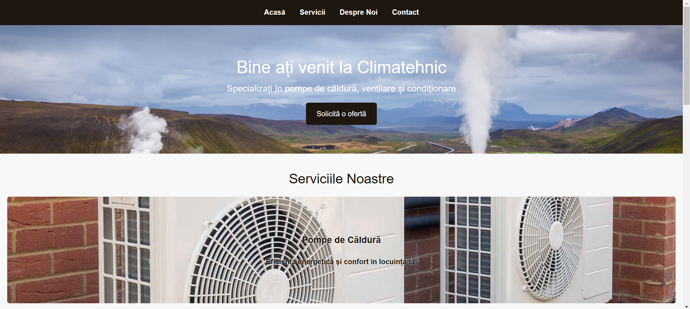

# Climatehnic Landing Page
Climatehnic is a landing page for a business specializing in **Pompe de Căldură, Ventilare și Condiționare**. This project was created as part of a lab assignment using HTML and CSS, without frameworks. It has a simple, minimalistic design with navigation, a call to action, and four distinct sections.

## Overview
The landing page is designed to show the services offered by Climatehnic. It includes:
- A navigation bar for quick access to each section.
- A hero section with a call-to-action button.
- A services section highlighting the main services.
- An about section with text on the left and an image on the right.
- A contact section with a form 
- A footer section with contact info (email and phone number).

## Screenshots

## Link to the live demo
https://katymun.github.io/PWLabs/lab2/

